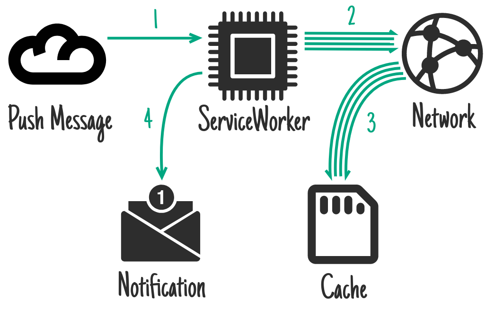

# <p align="center">Web Push Notification Demo</p>

# Usage
1. ## Install Dependency
    ```
    npm install
    ```
2. ## Start Server
    ```
    npm start
    ```

# Option Usage
- ## Generate New VAPID Key
    ```
    node vapid
    ```
- ## Expose Port with SSL
    
    use `ngrok` or `localtunnel` to proxy your local app with SSL and expose
    ```
    npx lt --port 5000
    ```

# Push API (Service worker) Flow



# Reference
- [service worker life cycle](https://jakearchibald.com/2014/offline-cookbook)
- [service worker API introduction](https://developers.google.com/web/fundamentals/primers/service-workers)
- [VAPID RFC-8292](https://tools.ietf.org/html/draft-ietf-webpush-vapid-01)
- [example code](https://github.com/thedamian/Web-Push-Example.git)
- [icon source](https://icon-icons.com/icon/bell-dot-notification-notify-ring/113401)
